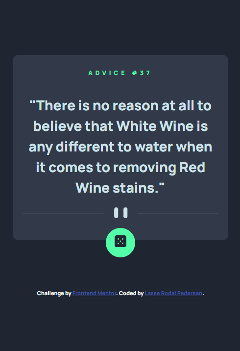

# Frontend Mentor - Advice generator app solution

This is a solution to the [Advice generator app challenge on Frontend Mentor](https://www.frontendmentor.io/challenges/advice-generator-app-QdUG-13db). Frontend Mentor challenges help you improve your coding skills by building realistic projects.

## Table of contents

- [Overview](#overview)
  - [The challenge](#the-challenge)
  - [Screenshot](#screenshot)
  - [Links](#links)
- [My process](#my-process)
  - [Built with](#built-with)
  - [What I learned](#what-i-learned)
- [Author](#author)

## Overview

### The challenge

Users should be able to:

- View the optimal layout for the app depending on their device's screen size
- See hover states for all interactive elements on the page
- Generate a new piece of advice by clicking the dice icon

### Screenshot

  
Desktop version

  

  
Mobile version

  

  
Active version

  

### Links

- [Solution URL:](https://your-solution-url.com)
- [Live Site URL:](https://your-live-site-url.com)

## My process

### Built with

- Semantic HTML5 markup
- CSS custom properties
- Flexbox
- Mobile-first workflow
- Javascript
- Fetch API - For API calls
- Google Fonts - For typography

### What I learned

In this project, I practiced fetching data from an API using JavaScript, enhancing my skills in asynchronous programming and handling JSON responses.

## Author

- Github - [Lasse Rodal Pedersen](https://github.com/Lasse-Rodal)
